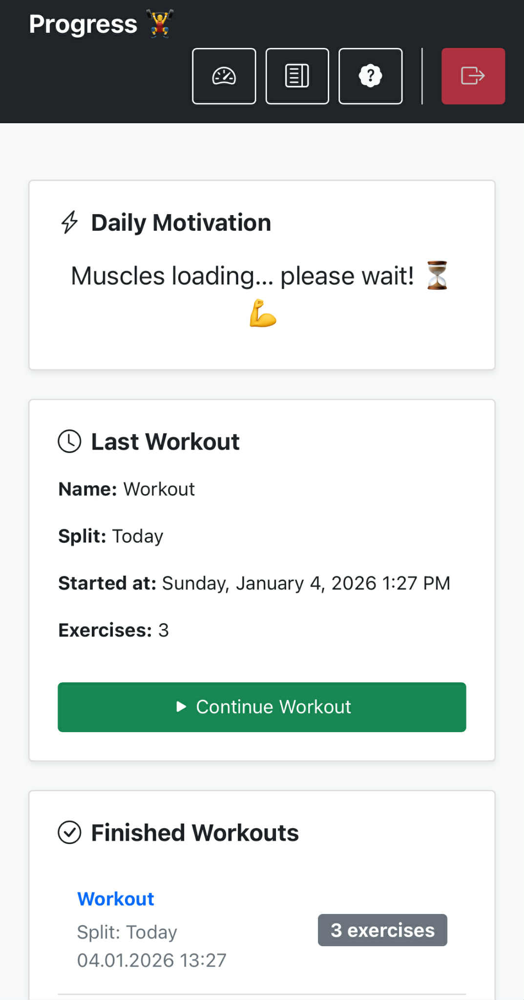

# Progress – Minimalist Gym Tracker 🏋️‍♂️

> **Note:** This project originated as a course finale. 

Progress is a web application designed for lifters who want to track their performance without unnecessary clutter or complex analytics. No social feeds, no data overload – just you and your workout.

[🔗 Live Preview (Hosted on runasp.net)](https://progressschool.runasp.net/)

##  Tech Stack
* **Backend:** ASP.NET Core 8 (MVC Architecture)
* **ORM:** Entity Framework Core
* **Database:** MS SQL Server
* **Frontend:** Razor Pages, Bootstrap 5, Custom CSS
* **Security:** ASP.NET Core Identity (Secure authentication and role-based authorization)

##  Key Features
- **Rapid Logging:** A mobile-first UI designed for quick data entry during active rest periods.
- **Privacy & Security:** Each user has an isolated training history linked to their encrypted account.
- **Workout History:** A streamlined chronological view of past sessions to monitor progressive overload.
- **Server-Side Validation:** Robust data integrity using Data Annotations and server-side logic to ensure valid weight/rep entries.

##  Architecture & Technical Implementation
- The application uses the **MVC pattern**  
- **Entity Framework Core** is used for database access  
- **Dependency Injection** is implemented for easier testing and maintainable code  
- Views are strongly typed and easy to extend  

## 📸 Preview

##  Roadmap & Future Development (Premium Vision)
The goal is to expand Progress into a tool for both advanced lifters and professional coaches:

- **Coach Mode:** Client profile management, remote programming, and real-time progress monitoring.
- **Advanced Metrics:** Per-set notes, body weight tracking, and unilateral exercise support (L/R limb tracking).
- **Analytical Modules:** Data visualization of long-term trends and automatic 1RM (One-Rep Max) calculation.
- **Smart Sharing:** JSON-based export/import functionality for sharing routines between users.
- **Workout Assistant:** Integrated rest timers and automated session duration tracking.

##  Local Setup & Installation
1. Clone the repository:
   `git clone https://github.com/Matt-code0/ProgressSchool`
2. Update the `ConnectionStrings` in `appsettings.json` to match your local MS SQL Server instance.
3. Open the **Package Manager Console** in Visual Studio and run:
   `Update-Database` (This will generate the database and tables via migrations).
4. Press **F5** to launch the application.

---
*Built with a focus on simplicity, speed, and functionality.*
